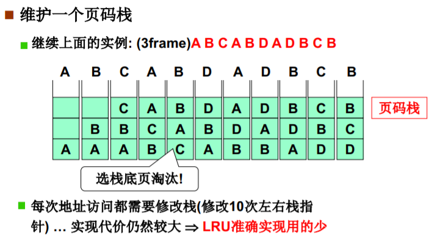

# 内存管理

## 如何使用内存

① 将程序从磁盘读取到内存中

② 把PC指向开始地址，使得CPU从内存中不断取指执行

## 地址重定位

要使用内存就必须考虑程序应该放到内存的哪个位置上。

程序中指令的操作地址在编写时写的是目标指令或数据相对于程序起始地址的偏移（偏移地址或逻辑地址）。

假如CPU在执行指令时将指令的操作地址都认为是物理地址，那么程序就应该从内存的0地址处开始存放，这样程序起始地址为0，指令的偏移地址才能准确定位到目标。但这样会产生问题：0地址处不是空闲内存（OS在初始化时已经放在此处了），而且如果能存放的话那同时也只能存放一个程序，不符合多进程。


所以实际情况应该是找一个空闲的内存空间并将程序放进去，这也会产生问题：此时指令中的偏移地址肯定不对。因此还需要将所有指令中的的偏移地址修改为实际的物理地址，这叫重定位（加个基址）。此时考虑的问题就是重定位应该在什么时候完成：

- 编译时重定位：在编译时就得知道内存哪些地方是空闲的，而且在将程序加载到内存时这些内存空间也必须是空闲的。这时程序只能放在固定位置，但载入效率高。

- 载入时重定位：载入时看看哪些地方空闲，就将指令中的偏移地址都加上这些空间的基址后再载入。这时程序一旦载入内存就不能动了。

往往程序载入后还需要移动（比如进行交换swap），因此这两种方法都不太妥当。所以重定位最合适的时机是运行时重定位。


- 运行时重定位：程序原封不动地载入内存，在每条指令运行时才完成重定位，这也叫地址翻译。假如程序载入后其入口地址为base（称为基址），则在执行指令时要将逻辑地址加上base来得到目标物理地址。

  

那么基址应该放在哪里呢？由于基址根据内存位置的变化而变化，而内存位置又根据进程的变化而变化，所以基址应该存放在进程的PCB中，那么每次执行指令时都可以从当前进程的PCB中获取基址来重定位。则运行时重定位的内存使用过程：

1. 原封不动地编译好程序；

2. 创建进程和PCB ；

3. 找到内存的一段空闲空间，将该空间的起始地址存入PCB中作为基址；

4. 将程序再原封不动地载入到这段空闲空间中；

5. 将PC指向该空间的起始地址；

6. 每次执行时进行地址翻译：物理地址 = 基址 + 逻辑地址。

   实际上进行地址翻译时，基址都是从基址寄存器中获取。每次进行上下文切换（进程切换）时，CPU都会从当前进程的PCB中取出基址赋给该寄存器。

## 分段机制

实际上的程序是分成好几个部分的，每个部分都单独载入内存，形成各自的内存段，比如代码段、数据段、栈段等，编写时每个段的地址都从0开始，因此每个段在内存中都有自己的基址，也就是说，如果要寻找代码段中的某个指令，那么其实际物理地址 = 该段对应的基址 + 该指令在该段中的偏移地址。


为什么要分段？因为每个部分都有自己的特点，比如代码段只读、数据段可读写、函数段需要动态载入、栈段需要动态增长等，如果将这些段放在一起载入内存而不分段管理，那么这些特点就无法展现出来。


为了能够完成一个程序中多个段的重定位，就需要有一个数据结构将每个段的基址保存，这个结构就叫段表。如下图所示：


这时就需要多个基址寄存器，每个基址寄存器代表程序中的一个段，因此也叫段基址寄存器。但此时的段基址寄存器存放的其实不是基址，而是段表中的段号（索引），执行指令时是先根据段基址寄存器中的段号从段表中找出基址，然后通过基址+逻辑地址的方式找到物理地址。

GDT表其实也是一个段表，该段表属于运行操作系统的进程，gdtr寄存器保存了该表在内存中的起始地址。而其它每个进程也有自己的段表，叫做LDT表，该表在内存中的起始地址存放在PCB中，每次进行上下文切换时CPU都会从PCB中取出该地址放在ldtr寄存器中（即进程切换，LDT表也跟着切换）。查表时就通过这两个寄存器找到对应表的位置。


分段机制下的内存使用过程：

1. 为程序的每个部分寻找空闲的内存段
2. 将内存段的基址初始化到LDT表中
3. 将LDT表地址存放到PCB中
4. 根据LDT表分段载入程序
5. 设置PC指针
6. 每次执行时根据LDT表进行地址翻译（重定位）：查LDT表（硬件实现）-> 基址+逻辑地址=物理地址

> LDT表就相当于映射表，使得进程只会在自己的段中跳转。

## 内存分区

内存分区就是如何在内存中找出一段空闲区域，或内存应该如何分割，使得程序的各个段可以载入到相应的内存分区中。

内存分区有两种方法：


1. 固定分区

   操作系统初始化时将内存空间等分成k个分区，每个分区用于存放程序的一个段。

   产生问题：每个段有大有小，太大时可能放不下，太小时一个分区就浪费了太多空间。

2. 可变分区

   根据程序段的大小来分配内存空间。要完成可变分区就至少需要维护2个数据结构以及还要有一个再分配算法。数据结构如下所示：

   

   1. 完成请求分配（假设有一个内存请求：reqSize=100K）

      

   2. 完成内存释放（假设段2不在需要了）

      

   3. 完成再分配（假设又有一个段提出内存请求：reqSize=40K）

      

      此时有两个空闲区域可以进行分配，那么应该分配哪一个区域呢？这就需要算法，这里有三种算法可以解决这个问题：

      - 首先适配：(350,150)。在多个可用区域中，选择第一个进行分配。效率最高。
      - 最佳适配：(200,50)。在多个可用区域中，选择长度与申请大小最接近的区域。容易产生内存碎片（因为太小而不能被再次分配的区域）。
      - 最差适配：(350,150)。在多个可用区域中，选择长度与申请大小差别最大的区域。容易产生较均匀的内存区域。

## 内存分页

内存分区不管采用哪种算法，最后都会产生一堆碎片，而使得内存利用率降低。


当内存分区后产生如下数据结构，如果此时有一个内存请求reqSize=160K，虽然总空闲空间>160，但没有一个空闲分区>160。为了解决这个问题，就需要进行内存紧缩，即将空闲分区合并，也就是将段3拷贝到段1上面，然而这个过程比较麻烦（还需要修改PCB等内容），CPU也无法为用户工作，这就造成用户等待。


> 内存分区一般用于虚拟内存的分段处理，而内存分页用于物理内存。
>
> 内存分页就是将内存的连续分配改变为离散分配。
>
> 内存分页对应的数据结构就是mem_map。

因此为了解决内存分区导致的内存效率问题，就有了内存分页这种方法。

- 内存分页的原理就是：将内存进行超细等分，分得的每个区域都非常小（一般只有4K），就把这4K的区域称之为页，以页为单位进行内存分配。

- 内存分页的分配过程：针对每个段内存请求，系统一页一页的分配给这个段，直到满足请求大小。

- 内存分页的特点：每个段最多浪费4K的内存，不需要内存紧缩。

- 内存分页的重定位（假设已将一个段打散成多个页并载入了内存）

  

  内存的每一页用页框号标识，可见段0放在了页框1、3、5、6，但其存放顺序是5、1、3、6，这些信息可以用一个数据结构表示，即页表。页表中的页号就表明了该段在所占页框中的存储顺序。

  

  假设段中有一个指令为mov [0x2240], %eax，那么[0x2240]表示的实际物理地址是在哪里？

  将0x2240除以页长（4K），所得商相当于将二值右移12位，对于16进制就是右移3位，即2，这就说明该逻辑地址对应的物理地址在页号为2的页框处（查表可知是页框3），其余数为240就是该物理地址在该页框内的偏移地址，所以实际的物理地址 = 3×4K + 0x240 = 0x3左移3位 + 0x240 = 0x3240。

  总结：将逻辑地址除以页长，所得商就是页号，所得余数就是页内偏移地址，即实际物理地址 = 商对应的页框号×页长+余数。对于一般情况，页长为4K，逻辑地址为4位16进制数，所以可以简化为：逻辑地址的最高位为页号，末三位为页内偏移地址，如图所示：

  

  所以整个重定位过程可以解释为：（这整个过程由MMU硬件单元完成）

  

  1. 从逻辑地址获得页号和页内偏移地址
  2. 根据页号查页表获取页框号
  3. 计算物理地址：页框号×页长+页内偏移地址

  > 页表的起始地址由cr3寄存器存储，也就是说，在查表时通过cr3寄存器来找到页表。
  >
  > 每个进程的页表地址都存放在PCB，切换进程就会从PCB将页表地址赋给cr3寄存器，从而切换页表。

## 多级页表和快表

在内存分页中，为了提高内存空间利用率，页应该小，但是页小了页表项就增多了，页表就大了。页表会很大，页表放置就成了问题。

比如页面尺寸通常为4K，而地址是32位的，有1M个页面，那么就有1M个页表项都得放在内存中，就需要4M内存。如果系统中并发100个进程，就需要400M内存。然而实际上程序不可能占到4G，大部分都在几十M左右，因此大部分页面根本不会用到。

> 将页表中的页号称为逻辑页号，页框号称为物理页号。
>
> 页表的功能就是根据逻辑页找到实际的物理页。

1. 第一种尝试：只存放用到的页❌

   

   即只有用到的逻辑页才有页表项，比如上面页表中2号逻辑页对应的页表项实际上没有对应的物理页，是无效的，那就可以将其剔除。

   产生问题：页表中的页号不连续，使得查找页表项时需要挨个比较（顺序查找），或可以通过折半（二分）查找来提高效率。但无论如何，这也使得每次执行指令都需要额外增加内存的访问次数，从而减慢了指令的执行速度。因此页号还是必须连续，这样一次访问就可以找到目标页（随机存取），所以也无法剔除那些无效的逻辑页，这些无效的逻辑页必须占住了它的位置，才能使页号连续。

   那怎么才能既连续又要让页表占用内存少呢？ 

2. 第二种尝试：多级页表（相当于书目录）⭕

   将页表分成多级存放，比如将映射到物理页的页表作为二级页表，而将映射到二级页表的页表作为一级页表，此时的逻辑地址就由三部分组成：

   

   逻辑地址由32位组成，12位偏移地址为页内偏移，10位页目录号为一级页表的索引，10位页号为二级页表的索引。页表项通常为4bytes，则一级页表的页表项最多有(2^10)个，可以映射(2^10)个二级页表，大小刚好4KB，只需要一页的内存；二级页表的页表项最多有(2^10)个，可以映射(2^10)个物理页，大小刚好4KB，只需要一页的内存。因此一个页表刚好占一页，一级页表可以映射4G内存，二级页表可以映射4M内存。

   - 如何重定位？先根据页目录指针找到一级页表，然后根据页目录号从一级页表中找到对应二级页表所在的物理页，最后根据页号从二级页表中找到对应指令所在的物理页。

     

   - 如何节省内存？总的来说就是二级页表可以不存在。首先每个页表的页表项应该是连续的，这样保证随机存取，所以一级页表和二级页表中的所有页表项都应存在，而且其中无效的页表项也应占住位置。然后一级页表中无效页表项对应的二级页表是可以不存在的， 也就是说，如果某个一级页表的页表项没有被用到，也就不需要创建这个页表项对应的二级页表，即可以在需要时才创建二级页表。 如上图所示，一级页表只有三个页表项有效，则多级页表总共占据的内存只有4K×4=16K（1个1级页表+3个2级页表），远小于原先的4M。
   - 所以这种尝试是正确的。

3. 快表（相当于书签）

   虽然多级页表节省了内存空间，也让页表能够随即存取，但多级页表还是增加了访存次数，而且页表级数越多，访存次数也越多。为了减少访存次数，增加了一个缓存寄存器（一组相联快速存储），用于存放最近使用的一些物理页的映射（相当于不连续的小页表），这个寄存器叫做TLB，即快表。

   也就是说，在进行重定位时，先通过快表来获取物理页号，如果未命中则再从多级页表中获取相应的物理页号，并将该映射存到快表中。即 TLB命中时效率会很高，未命中时效率降低。

   

   

   从快表中获取物理页号的过程由硬件一次比对完成，速度很快。

   - TLB命中率的影响：如果快表的命中率高则有效访问时间短，反之则长。

     

   - TLB条目数一般在64-1024之间，而相比相比220个页，64很小，为什么TLB就能起作用？这是由程序本身对地址访问存在局部性决定的，即空间局部性，程序执行时对某一局部代码的访问频率会非常高，这对于TLB的使用就非常有效。

     

4. 因此内存分页的最终结构为多级页表+快表。

## 段页结合

用户程序采用分段结构，物理内存采用分页结构，因此程序员希望用段，物理内存希望用页，所以要段页结合。

### 段页结合的样子


对于用户来说，他觉得内存是分段的，并不知道底层的分页映射。因此，用户还是以段的连续方式来寻址和访问"内存"。

对于用户是段的使用，对于内存是页的使用。

虚拟内存分配段给用户使用，物理内存分配页给虚拟内存使用。


### 段页结合时的重定位


两层映射：逻辑地址（程序中的地址） -> 虚拟地址（虚拟内存中的地址） -> 物理地址（物理内存中的地址）

1. 用户在程序中给出逻辑地址（段号+偏移）；
2. 段重定位（找到虚拟地址）：根据段号从段表中找到段基址，则虚拟地址=段基址+偏移；

3. 页重定位（找到物理地址）：根据虚拟地址中的页号从页表中找到物理页号，则物理地址=物理页号×页长+偏移；

4. 将物理地址放到地址总线上来获取指令或数据。

### 段页结合的代码实现

#### 整体简述


1. 用户将程序进行分段，并利用分区算法从虚拟内存中割出一段区域给用户的数据段。这个过程完全假想，不需要实际操作，创建对应的段表就是在完成这个过程。（分区+段表）
2. 将数据段打散成页，然后把数据段中的每一页从磁盘中读取到物理内存的空闲物理页上，最后创建页表。（分页+页表）

即分配段，建段表；分配页，建页表。总结起来就两步：分配内存和建立映射（实现重定位）。

#### 代码实现

内存分配从进程创建开始，因此这段代码从创建进程的fork调用开始，由于子进程刚创建时与父进程用的是同一个程序，因此就不需要程序的物理内存分配和载入过程，只需要实现段表和页表的创建。fork调用最终会执行copy_process函数，这个函数调用了copy_mem函数：

```C
int copy_process(int nr,......)
{	
    ......
    // nr为进程号；p为子进程的PCB指针
	if (copy_mem(nr,p)) { 
		task[nr] = NULL;
		free_page((long) p);
		return -EAGAIN;
	}
	......
}
```

copy_mem函数的作用就是创建段表和页表，其执行过程如下：

```c
int copy_mem(int nr,struct task_struct * p)
{
	unsigned long old_data_base,new_data_base;
	unsigned long old_code_base,new_code_base;
	......
    // 获取父进程的虚拟地址
	old_code_base = get_base(current->ldt[1]);
	old_data_base = get_base(current->ldt[2]);
    ......
    // 给子进程分配一个虚拟地址（分配段）
	new_data_base = new_code_base = nr * TASK_SIZE;
	// 设置段表
	p->start_code = new_code_base;
	set_base(p->ldt[1],new_code_base);
	set_base(p->ldt[2],new_data_base);
    // 以下是创建页表的过程
	if (copy_page_tables(old_data_base,new_data_base,data_limit)) {
		free_page_tables(new_data_base,data_limit);
		return -ENOMEM;
	}
	return 0;
}
```

1. 分配段和创建段表：将子进程的代码段和数据段的段基址设置为（64MB * 其任务号），这个设置过程就是将虚拟内存的一段空间进行分配。然后将该段基址设置为子进程段表（LDT）中对应段描述符的基地址字段值，这个设置过程就是创建对应的段表。

   > 段基址是该段的起始虚拟地址，并不是偏移地址。
   >
   > 为了简化，这里采用等长分割的方法给程序分配段，即每个程序所分配到的虚存都是64M，互不重叠，而且每个程序中的代码段和数据段都共用一个段。如果虚拟区域互不重叠且使用单级页表，则各个进程可以使用同一张页表，使得重定位时可以不切换页表。
   >
   >  

2. 分配页以及创建页目录表和页表：由于子进程与父进程的程序相同，所以不需要分配页，只需要创建对应的页目录表和页表，而且父进程和子进程的页表相同。因此接着调用了copy_page_tables函数将父进程的页表拷贝到子进程的页表中：

   ```C
   int copy_page_tables(unsigned long from,unsigned long to,long size)
   {
   	unsigned long * from_page_table;
   	unsigned long * to_page_table;
   	unsigned long this_page;
   	unsigned long * from_dir, * to_dir;
   	unsigned long new_page;
   	unsigned long nr;
   	......
        // 获取父进程和子进程的页目录表项地址
   	from_dir = (unsigned long *) ((from>>20) & 0xffc); /* _pg_dir = 0 */
   	to_dir = (unsigned long *) ((to>>20) & 0xffc);
   	size = ((unsigned) (size+0x3fffff)) >> 22;
       
        // 循环处理所有页目录表项
   	 // from_dir和to_dir是long型数据（4字节），加1就是加4字节，就是下一个表项地址
   	for( ; size-->0 ; from_dir++,to_dir++) {
   		......
            // 获取父进程页目录表项中的页表地址
   		from_page_table = (unsigned long *) (0xfffff000 & *from_dir);
            // 为子进程当前的页目标表项创建一个页表
   		if (!(to_page_table = (unsigned long *) get_free_page()))
   			return -1; 
            // 将页表设置成用户级，并将页表地址存放到页目录表项中
   		*to_dir = ((unsigned long) to_page_table) | 7;
            // 获取页表的表项个数
   		nr = (from==0)?0xA0:1024;
   
            // 循环将父进程页表拷贝到子进程页表中
   		for ( ; nr-- > 0 ; from_page_table++,to_page_table++) {
   			this_page = *from_page_table;
   			if (!this_page)
   				continue;
   			......
   			this_page &= ~2; // 设置成只读
   			*to_page_table = this_page;
   
   			if (this_page > LOW_MEM) {
   				*from_page_table = this_page; // 令源页表项也只读。
   				this_page -= LOW_MEM;
   				this_page >>= 12;
   				mem_map[this_page]++; // 将访存次数加1
   			}
   		}
   	}
   	invalidate(); // 刷新页变换高速缓冲。
   	return 0;
   }
   ```

   传入copy_page_tables函数的参数为父进程和子进程在虚拟内存中的起始虚拟地址，根据这两个地址可以计算出父进程和子进程在页目录表中的起始地址。然后计算出页目录表项的个数size，接着根据size的大小循环处理每一个页目录表项，即将父进程页目录表项对应的页表拷贝到子进程对应创建的页表中。

   

   > **根据虚拟地址计算表项地址**
   >
   > 虚拟地址的高10为为页目录号，将虚拟地址右移22位取出页目录号，然后乘以4就是表项地址。
   >
   > 其实，页目录号是一个索引，该索引对应表项的实际地址应为(页目录表起始地址+页目录号×4)，所以(页目录号×4)理应是表项在页目录表中的偏移地址。但由于页目录表存放在0地址处，所以这里的偏移地址就是实际的物理地址。
   >
   > 而且所有进程的页目录表都是共用一套的，因此父进程和子进程的计算过程都是一样的。此外，该表在系统初始化时就存在了，也不需要创建，只需要找到对应表项进行信息填充就可以完成页目录表的创建。
   >
   > **get_free_page函数**
   >
   > 这个函数的作用就是从mem_map中找到一页空闲内存并返回给调用者使用。
   >
   >     

3. 在分配完内存并关联好映射后程序就可以执行了，进程推进就会带动内存工作。假如父进程执行一个指令，向内存0x300处写入7，则经过两层映射后找到该地址的实际地址，将其放入地址总线，数据7放入数据总线，7就会被存入对应地址中。接着子进程也执行相同的指令，但此时写入8，由于子进程与父进程的数据段相同，所以也在相同地址写入，但因为子进程只读，所以写时会进行分离，即另外开辟一页内存地址，并将该页内存替换原来那页内存的映射，然后在新的页上进行写入。

   这样父子进程的映射就分离开了，使得进程之间的影响就消除了，即使两个进程访问相同地址，它们也不会被彼此影响。这也是每个进程都要创建一个页表的原因。

   

### 其它注意

1. 通过段表就可以知道一个逻辑地址在虚拟内存的位置（虚拟地址），通过页表就可以知道一个虚拟地址在物理内存的位置。因此通过段表和页表的映射就可以知道一个逻辑地址在在物理内存的位置，虚拟内存就是这两者转变的过渡，这使得用户可以专心于段，而不用考虑底层的分页机制。
2. 逻辑地址由段号和偏移地址组成，根据段号在段表中就可以找到对应的段基址，从而计算出虚拟地址（段基址+偏移地址）。虚拟地址由页目录号、页号和偏移组成，由页目录号和页号就可以从页目录表和页表中找到对应的物理页号，从而计算出物理地址（物理页号×4+偏移）。
3. 一级页表以4MB为标准划分4GB内存，二级页表以4KB为标准划分一级页表划分出来的4MB内存。一级页表也叫页目录表，二级页表就叫页表。
4. 一个程序在虚拟内存中的样子

 

4. 页目录表和页表的结构

 

5. 虚拟地址中各项的映射关系

 

6. 虚拟地址和物理地址的对应关系

 

7. 段页结合代码实现的总结
   - 分配段：根据算法（这里是 64M×进程号 ）在虚拟内存中找到一段空闲空间，这就是程序在虚拟内存中的位置，用该空间的起始地址（段基址）来标识。
   
     （找到段基址）
   
   - 建立段表：向段表的指定段号对应的表项添加段基址字段。段号由自己决定数值和所代表的段类型，只要在使用时记得就行了。比如我们决定段号为3对应的是代码段，那么就在段表索引为3的表项中添加代码段的起始地址，使用时就将代码段寄存器的值赋为3。
   
     （在段表的指定段号处填入段基址）
   
   - 分配页：在物理内存中找到空闲的物理页，然后将程序打散成页后载入到这些物理页中，并且记住对应的物理页号。
   
     （将程序打散册成页并载入内存）
   
   - 建立页表：一个虚拟地址就对应了页表的一项，根据程序的虚拟地址在相应的页表中添加对应的物理页号就完成了页表的建立。建立段表后就可以知道程序的虚拟地址，而虚拟地址的高10位为页目录号，中间10位为页号。页目录表本身存在而不需要创建，我们只需根据页目录号找到对应的表项，为该表项创建空白页表，并将空白页表的起始地址填入表项中，这就完成了页目录表的创建。然后根据页号在页表中找到对应表项，并填入该虚拟地址对应数据在物理内存中的物理页号，这就完成了页表的创建。
   
     （根据虚拟地址在页表中填入物理页号）

## 内存的换入换出

### 为什么要换入换出

虚拟内存是连接分段和分页的核心，而要实现虚拟内存就必须要有内存的换入换出机制。

虚拟内存就是一个地址空间，也就是一堆地址的集合，可以看成是物理内存的一种镜像。程序必须先映射到虚拟内存，再从虚拟内存映射到物理内存才能被使用。

但从虚拟内存映射到物理内存这个过程用户是看不到的，用户只能看到虚拟内存，并且认为虚拟内存就是实际的内存，而且在用户的眼里，这4GB的虚拟内存可以随意使用，就好像单独拥有了4GB的内存。这就是操作系统给用户营造的假想，即一块大而规整且可随意分段的内存。


内存的换入换出就是在映射上做文章。有了映射就可以让物理内存看起来更大。比如虚拟内存有4GB，而实际的物理内存只有1G，但在用户看来，这就是4GB的内存。这对用户来说就很方便，他可以不用考虑内存的大小而随意编写程序，由操作系统负责隐藏和实现底层硬件使用的细节。

那么才能让1GB的物理内存看起来有4GB呢？方法就是：假设用户的程序填满了虚拟内存，当用户访问虚拟内存中0-1GB的那一段程序时，操作系统就把这部分的内容映射到物理内存上；当用户再访问虚拟内存中3-4GB的那一段程序时，操作系统再把这部分的内容映射到物理内存上。总结来说就是用的时候才映射，这就是换入换出的基本想法。


此外，由于换入换出都是由操作系统完成的，对用户不可见，因此在用户的角度来看，用户总是感觉这0-4GB的程序都已经在内存中了。

详细地来说，换入就是将用户当前要使用到的那一段程序从磁盘中载入到物理内存中并且建立起映射，当使用到另一部分的内容时再把该内容从磁盘中换入到物理内存并建立起另一种映射。

> 注意，程序并不是从虚拟内存写入到物理内存上，虚拟内存只是一种虚拟的结构，没有实际的硬件实现，它只是一种用来组织和管理物理内存的程序，虽然说给程序在虚拟内存上分配段，但这只是一种假想的过程，程序自始至终都保存在磁盘上。

这就是要用换入换出来实现虚拟内存的原因，让虚拟内存看起来比内存更大。这种关系就可以类比现实生活中的仓库和商店的关系，仓库存的货多，店面展示的商品少，当顾客想要的商品没有在货架上，店员就从仓库取出放到货架上，并替换掉顾客不需要的商品。

### 换入的实现方法--请求调页

换入的过程可以总结为：请求调页，建立映射。

用户用逻辑地址可以随意访问虚拟内存中0~4GB的程序，然后根据逻辑地址从段表中取出段基址形成虚拟地址，这虚拟地址可以是虚拟内存中的任意一个，使得用户感觉这0~4GB的地址可以随意使用。当进行页表的查询时，发现虚拟地址中的页号没有对应的映射，这就说明该虚拟地址对应的数据没有在内存中（也就是缺页），此时操作系统就会从磁盘中开始调页。这就是换入的基本样子。

具体来说：当进程执行到某个指令时，该指令需要访问一个逻辑地址（这就是请求），然后MMU单元就会去查段表和查页表，如果发现页表缺页，就会保持当前PC指针的值并给中断寄存器打上标记，CPU执行完指令后就会查询中断寄存器，发现有中断请求，于是触发页错误处理程序，该程序就从磁盘中根据算法找到缺失的页面，然后将该页调入内存的空闲物理页中（这就是调页），并将该页的物理页号填入表中建立起映射（这就是建立映射），此时中断处理结束，就返回到原指令处重新执行。


其实除了请求调页外，还可以请求调段，但实际情况中往往采用请求调页，这是因为请求调页的粒度更细，更能提高内存的效率。

#### 请求调页的实现代码

查表发现缺页并请求中断这个过程由MMU单元自动完成，无法进行控制，能控制得就是缺页中断处理程序，因此请求调页的实现代码从缺页中断开始。

1. 设置中断

   先从系统手册中查询缺页中断的中断号，然后在系统初始化时，设置该中断号由哪个程序进行处理。

   

2. 缺页中断处理程序page_fault

   

   - 保护现场，切换到内核数据段

   - 取出页错误线性地址（即所缺页的虚拟地址）并压栈作为调用do_no_page函数的参数，然后执行do_no_page函数：

     

     - 从虚拟地址计算出页目录号和页号，以作为之后建立映射的参数。

     - 申请一个空闲物理页，然后调用bread_page函数从当前进程可执行文件对应的磁盘中将缺失的部分读到刚申请的空闲物理页中。

     - 接着调用put_page将该空闲物理页对应的页框号与虚拟地址进行关联（即填写页表），建立映射：

       

       - 从地址参数计算出页目录号，然后根据页目录号找到对应的页目录项，接着根据页目录项找到对应的页表，如果页表不存在就申请一个空白页作为页表，然后将根据地址参数中的页号找到页表项，填入换入页面的物理页框号。

### 内存换出的实现

内存不可能一直进行换入，因为虚拟内存更大，而物理内存较小，内存始终会满的，如果继续换入就会造成溢出，因此就需要换出这种机制来腾出空间让新的内容换入，所以有换入就应该有换出。

这个故事就要从中断换入程序的get_free_page调用说起，这个函数并不能总是获得新的页，因为内存是有限的，所以就需要选择一页来淘汰并换出到磁盘中，以腾出新的空白页返回给调用者使用，那么要选择哪一页呢？

可以看出，换出的重点就是选择要换出的页，因此主要讲的是算法。我们先看get_free_page函数的执行过程，该函数用于获取一个新的空白物理页，首先就要计算当前内存是否有空白页，如果没有，那就需要找出一页换出，再继续申请。所以换出的算法应该填写到该函数中，现在来看看有哪些选页换出算法：

> 算法也不一定必须放在get_free_page函数中，也可以放在其它合适的地方，然后和get_free_page函数配合使用来实现换入和换出的效果。
>
> 换出算法的评价标准：缺页次数（间接反映置换次数）。

1. FIFO算法：最早换入的最先换出。

   假设物理内存只分配了3个页框，页面引用序列为ABCABDADBCB，则这个算法的调度过程如下所示：

   

   可见这个算法会导致一个页面刚换出去又换进来，进而使缺页次数较多，足有7次，所以FIFO算法不太合适。

2. MIN算法： 选最远将使用的页淘汰，属于最优方案。这个算法是向后观察，在需要置换时看一看之后的引用序列中哪个引用是最遥远的，不需要置换后马上用到，那么就把该引用给淘汰出去。

   用该算法调度上例的过程如下：

   

   这个算法的缺页次数就降低了一些，只需要5次了，但是这个算法需要预知未来发生的事情，所以也不可行。

3. LRU算法：用过去的历史预测将来，即选最近最长一段时间没有使用或最少使用的页淘汰。这里用到了程序执行的局部性原理，即最近一段时间老使用的页待会也会使用。

   

#### 如何实现LRU算法

1. 使用时间戳（准确实现）

   每个页都维护一个时间戳，当置换的时候，选择时间戳最小的那个页进行淘汰。

   

2. 使用页码栈（准确实现）

   

3. 近似实现：以上两个方法都是LRU算法的准确实现，实现代价都太大，因此就只能寻求LRU算法的近似实现。

   - **clock算法**

     将时间计数改为是和否，即用最近是否使用改为最近最少使用。这个实现方法也叫二次机会算法。

     

     - 给每个页增加一个引用位，该位为1说明当前页最近被使用了，该位为0说明当前页最近没有被使用。
     - 每次访问页时，就将所访问页的引用位设置为1，这个过程由MMU硬件单元自动完成。
     - 选择淘汰页时，就对所有页的引用位进行扫描，当指针扫描到某一页时，如果该页的引用位为1，则将其重置为0，暂不换出， 给该页第二次驻留内存的机会，然后继续扫描；如果该页的引用位为0，则将该页淘汰，并将指针拨到下一页处，等待下一次扫描。（所有的页面形成一个环形数组，便于扫描）
     - 这个算法的"最近"体现在当指针扫描一圈回到原处后，如果原处的页在这段时间内其引用位还没有被置成1，那说明该页最近没有被使用过，就应该被淘汰。
     - 这个算法的代价小，体现在① 引用位的修改非常简单；② 每次访问只需要修改所访问页的引用位；③ 引用位存放在页表项中，因此引用位的修改在MMU查询页表时顺带完成；④ 缺页次数少，花在扫描上的时间也少。

   - **clock算法的改进**

     

     - 为什么要改进？

       一个页面的引用位要变成0，就必须等缺页进行置换时指针转动到该页的引用位处。但通常缺页次数很少，因为程序具有局部性，这就可能导致指针很长一段时间都不会转动，使得所有页面都被访问过，而让所有页面的引用位都变成1。如果此时发生缺页进行扫描，所有页面的引用位又都会被挨个扫描并置成0，然后指针回到原处并将原处的页进行淘汰，并将指针拨到下一页处等待下一次扫描。接着很长一段时间又不发生缺页，所有页面的引用位又都变成1，此时发生缺页时就会按照上面的过程把指针当前指向的页进行淘汰，并将指针拨到下一页处等待下一次扫描。按照这种规律发展下去，选择淘汰就变成顺序淘汰了，此时的clock算法就退化成了FIFO算法。

     - 问题原因

       缺页次数少，导致"最近"这个时间段被拉得很长，使得历史信息保留过长时间。

     - 如何改进？

       定时将页面引用位重置为0。具体方法：再增加一个重置指针，这个指针定时扫描所有页面并将它们的引用位重置为0，由这个指针保证"最近"这个时间段在合适的长度内。而另一个指针还是作为淘汰指针，只在缺页时转动，选择淘汰页。在这两个指针的配合下，情况就变成了这样，如果一个页面在重置为0到淘汰指针转到此处的这段时间内没有被访问过，那么该页面就应该被淘汰。

     - 总结改进

       用重置指针清除过长的历史信息，用淘汰指针选择并淘汰最近没有被访问的页面。重置指针的执行要放到时钟中断中，淘汰指针的执行要放到get_free_page函数中。

### 页框分配问题


这个问题就是需要给一个进程分配多少个物理页框。

分配多了会使缺页次数减少，但内存有限，不可能太多，而且也无法体现出内存的高效利用

分配少了就会产生颠簸现象，即当系统进程增多，导致每个进程分得的页数减少，使得缺页率增加，缺页率大了就会使CPU更多的时间是处于等待调页的状态，CPU的利用率就降低了，此时系统就处于不断换入换出的状态，也就是颠簸。

> 系统颠簸，解释为在请求分页存储管理中，从主存（DRAM）中刚刚换出（Swap Out）某一页面后（换出到Disk），根据请求马上又换入（Swap In）该页，这种反复换出换入的现象。

解决方法：① 利用程序的局部性原理，通过一些算法计算出程序的这个局部大小需要多少页框才能覆盖住，就分配多少的页框；② 也可以根据缺页率动态调整页框的分配数，缺页率大就分的多点，缺页率小就分的少点。

为了避免系统颠簸，页框的分配就应该动态调整。但如果进程数多了，无论如何分配也覆盖不住程序的局部，这时候就应该限制进程的数量。

### 换入换出的完整样子


## 重新看多进程图像

子进程与父进程共用一套程序，这套程序在进程创建前就已经存储到磁盘上了。这套程序包括了许多任务，子进程和父进程分别执行和完成这些任务中的一个或多个。

子进程和父进程并不是共用同一段内存来加载程序，它们有自己的物理页，分别通过换入换出机制来加载自己要使用的那部分任务。但它们共用一段虚拟内存，这套程序被完整地加载到了这段虚存中，因此子进程和父进程都使用同一个段基址，这也就是子进程要从父进程拷贝程序执行状态的原因，使得子进程可以获取自己在这套程序中需要执行的任务。

子进程和父进程执行的都是这套程序中的不同部分，而且它们之间互不关联，因此当子进程拥有自己的用户栈以后，子进程和父进程之间就毫无瓜葛了，除非这两个进程执行的任务需要合作。